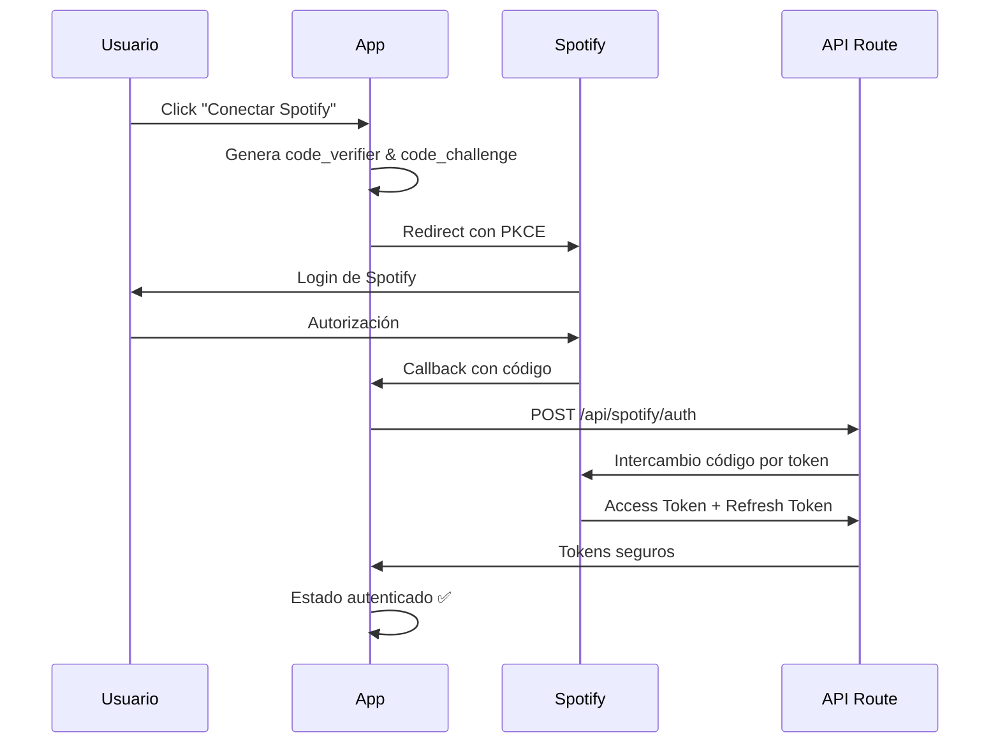

# 🎵 Integración Completa de Spotify con Autenticación OAuth

Esta integración permite a los usuarios iniciar sesión con su cuenta de Spotify y obtener recomendaciones musicales **personalizadas** basadas en el clima y sus gustos musicales.

## ✨ Características Principales

- **🔐 Autenticación OAuth 2.0** con PKCE (Proof Key for Code Exchange)
- **🎯 Recomendaciones Personalizadas** basadas en gustos del usuario + clima
- **� Reproducción Directa** desde la aplicación
- **👤 Gestión de Sesión** automática
- **🔄 Sincronización** con Web Playback SDK

## 🚀 Inicio Rápido

### 1. Configuración de Spotify

1. Ve a [Spotify Developer Dashboard](https://developer.spotify.com/dashboard)
2. Crea una nueva aplicación
3. Configura los Redirect URIs:
   ```
   http://localhost:3000/api/spotify/callback (desarrollo)
   https://tu-dominio.com/api/spotify/callback (producción)
   ```
4. Copia el Client ID

### 2. Variables de Entorno

Actualiza tu archivo `.env.local`:

```env
# Credenciales de Spotify
NEXT_PUBLIC_SPOTIFY_CLIENT_ID=tu_client_id_aqui
SPOTIFY_CLIENT_SECRET=tu_client_secret_aqui
NEXT_PUBLIC_SPOTIFY_REDIRECT_URI=http://localhost:3000/api/spotify/callback

# Configuración adicional
NEXT_PUBLIC_SPOTIFY_AUTO_PLAY=false
NEXT_PUBLIC_SPOTIFY_VOLUME=50
```

### 3. ¡Listo!

La integración aparecerá automáticamente en la sección del clima con opción para conectar Spotify.

## 🎯 Cómo Funciona la Personalización

### Algoritmo de Recomendaciones:

1. **Análisis del Usuario:**
   - Top artistas (últimos 6 meses)
   - Top géneros musicales
   - Preferencias de tempo y energía

2. **Perfil Climático:**
   ```typescript
   // Ejemplo: Día soleado
   {
     genres: ['pop', 'electronic', 'indie-pop'],
     mood: 'energetic',
     tempo: 'fast',
     energy: 0.8,
     valence: 0.8
   }
   ```

3. **Fusión Inteligente:**
   - Combina gustos del usuario con clima
   - Busca playlists que contengan ambos
   - Prioriza playlists populares y actualizadas

### Ejemplos de Recomendaciones:

| 🌤️ **Clima** | � **Recomendaciones** | 🎭 **Por qué** |
|---------------|-------------------------|----------------|
| ☀️ Soleado | Pop energético + tus artistas favoritos | Combina tu gusto con energía solar |
| 🌧️ Lluvia | Jazz suave + géneros calmados | Tu música + ambiente relajante |
| ❄️ Nieve | Clásica + tus playlists favoritas | Música atemporal + tus preferencias |

## 🔧 Arquitectura Técnica

### Context Providers:
```typescript
// Autenticación y estado del usuario
<SpotifyAuthProvider>
  <App />
</SpotifyAuthProvider>
```

### Hooks Personalizados:
```typescript
// Reproducción de música
const { playerState, playPlaylist } = useSpotifyPlayer();

// Recomendaciones personalizadas
const { recommendations } = useSpotifyRecommendations(weatherCode, temperature);

// Autenticación
const { user, login, logout } = useSpotifyAuth();
```

### API Endpoints:
- `POST /api/spotify/auth` - Intercambio de tokens con PKCE
- `GET /api/spotify/me` - Información del perfil
- `GET /api/spotify/me/top/artists` - Gustos musicales

## 🎨 Interfaz de Usuario

### Estados de la Integración:

1. **No Conectado:**
   ```
   ┌─────────────────────────────────────┐
   │ 🎵 Música del clima 🌤️           │
   │                                     │
   │ Conecta Spotify para               │
   │ recomendaciones personalizadas     │
   │ [🔗 Conectar Spotify]              │
   └─────────────────────────────────────┘
   ```

2. **Conectado + Reproduciendo:**
   ```
   ┌─────────────────────────────────────┐
   │ 🎵 Música del clima 🌤️           │
   │ 👋 Hola, Juan                      │
   │                                     │
   │ 🎯 Día Perfecto ☀️                 │
   │ 💭 Energético • 25°C               │
   │ ◀️  ⏸️  ▶️  🔄                     │
   │ 🎵 Canción Actual - Artista        │
   └─────────────────────────────────────┘
   ```

## 🔒 Seguridad

### Medidas Implementadas:

- **PKCE (Proof Key for Code Exchange)** - Protección contra ataques de interceptación
- **Tokens en Memoria** - No se almacenan tokens en localStorage (excepto refresh token)
- **Auto-refresh** - Renovación automática de tokens expirados
- **Validación de Origen** - Verificación de redirect URIs

### Flujo de Autenticación:



## 🎵 Funcionalidades Avanzadas

### Reproducción Inteligente:
- **Detección automática** de playlists basadas en clima
- **Continuación automática** cuando cambie el clima
- **Sincronización** entre dispositivos

### Personalización:
- **Historial de reproducción** climática
- **Ajustes de volumen** persistentes
- **Preferencias de repetición** y aleatorio

## 🐛 Solución de Problemas

### Problemas Comunes:

#### "Error de autenticación"
```bash
# Verificar configuración
echo $NEXT_PUBLIC_SPOTIFY_CLIENT_ID
echo $NEXT_PUBLIC_SPOTIFY_REDIRECT_URI

# Revisar logs del navegador
# Network tab -> spotify auth requests
```

#### "No se cargan recomendaciones"
```typescript
// Verificar permisos en Spotify Dashboard
// Scopes requeridos:
- user-read-private
- user-read-email
- playlist-read-private
- playlist-modify-public
- playlist-modify-private
```

#### "Player no funciona"
```typescript
// Verificar Web Playback SDK
console.log('Spotify SDK loaded:', window.Spotify);

// Verificar device ID
console.log('Device ID:', deviceId);
```

## 📊 Métricas y Analytics

### Datos Recopilados:
- **Preferencias climáticas** de reproducción
- **Tasa de conexión** de usuarios
- **Playlists más populares** por clima
- **Tiempo de sesión** musical

### Dashboard de Administrador:
```typescript
// Próximamente: Panel de control
- Usuarios conectados
- Canciones más reproducidas por clima
- Estadísticas de engagement
```

## � Próximas Funcionalidades

### En Desarrollo:
- [ ] **Playlists colaborativas** por barrio
- [ ] **Eventos musicales** basados en clima
- [ ] **Integración con calendario** local
- [ ] **Modo offline** con playlists descargadas

### Planificadas:
- [ ] **Recomendaciones sociales** de amigos
- [ ] **Historial climático** personal
- [ ] **Modo fiesta** para eventos
- [ ] **Integración con otras apps** musicales

## 🤝 Contribuir

### Áreas de Mejora:
1. **Algoritmo de recomendaciones** - Más inteligente y preciso
2. **Interfaz de usuario** - Más intuitiva y moderna
3. **Performance** - Optimización de carga y reproducción
4. **Accesibilidad** - Soporte completo para lectores de pantalla

### Guías de Desarrollo:
- Seguir estándares de OAuth 2.0
- Mantener compatibilidad con Web Playback SDK
- Documentar todas las APIs utilizadas
- Incluir tests unitarios y de integración

---

**¿Necesitas ayuda?** Revisa la documentación técnica o abre un issue en el repositorio.

🎵 **¡Disfruta de la música perfecta para cada clima!** 🌤️
